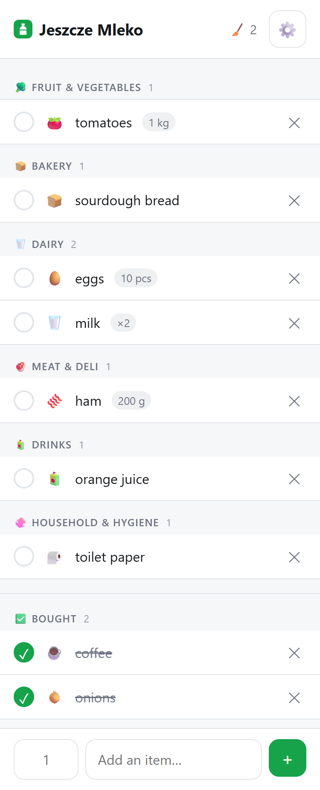

# Jeszcze Mleko 🥛

A shared shopping list as a PWA. Everyone in the household joins with a single
code, and changes show up instantly for all of them.

- add and delete items, with undo
- items file themselves into store departments by name, in Polish and English
- check off what's bought; bought items collect at the bottom
- an amount alongside the name — "6", "50 dag", "1,5 l" — lifted out of the name
  when you type it there instead
- suggestions from what this device has added before
- interface in English or Polish, following the browser
- works offline and installs like an app

**Zero dependencies.** No `package.json`, no `node_modules`, no build step — plain
HTML/CSS/JS with the Firebase SDK loaded as an ES module from a CDN. The
repository *is* what gets served.

Live at **https://rafalpawlisz.github.io/jeszcze-mleko/**



---

## Setup

### 1. Firebase

1. [console.firebase.google.com](https://console.firebase.google.com) → **Add project**
2. **Authentication** → Get started → **Sign-in method** → enable **Anonymous**
3. **Firestore Database** → Create database → **production** mode → pick a region
4. **Project settings** → *Your apps* → `</>` → copy `firebaseConfig` into
   [`firebase-config.js`](firebase-config.js)
5. **Firestore → Rules** → paste [`firestore.rules`](firestore.rules) → Publish

The API key and project id are **not secrets** — they identify the project but
authorize nothing, and the browser sends them on every request anyway. The rules
and App Check are what hold the line.

### 2. reCAPTCHA v3 + App Check

Anonymous sign-in means anyone can mint accounts, so App Check proves requests
come from your app in a real browser. reCAPTCHA v3 is invisible.

1. [reCAPTCHA admin](https://www.google.com/recaptcha/admin) → **+** →
   **reCAPTCHA v3** → domains `localhost` and `YOUR-USERNAME.github.io`
2. Site key → `recaptchaSiteKey` in `firebase-config.js`
3. Firebase → **App Check** → your web app → **reCAPTCHA v3** → paste the secret
4. Register **Cloud Firestore** and **Authentication**, but leave them
   **unenforced** for now

### 3. Run it

```bash
node serve.js
```

Then `http://localhost:8000`. ES modules will not load over `file://`, hence the
server; [`serve.js`](serve.js) uses only Node built-ins.

The console prints an **App Check debug token** on first run. Register it under
Firebase → App Check → Apps → ⋮ → Manage debug tokens. It is per browser profile,
so every browser you develop in needs its own. Treat it like a password — it
bypasses App Check — and never commit it.

### 4. Deploy

Push to GitHub, then **Settings → Pages** → deploy from `main`, folder `/`.
Finally add `YOUR-USERNAME.github.io` to Firebase → **Authentication → Settings →
Authorized domains**.

### 5. Optional: restrict the API key

[Cloud Console → Credentials](https://console.cloud.google.com/apis/credentials) →
"Browser key" → *Application restrictions* → **Websites**:

```
http://localhost:8000/*
https://YOUR-USERNAME.github.io/*
```

Full URLs, with the scheme and a trailing `/*`, and the dev port spelled out. **A
bare host, or `localhost:*`, does not match and locks you out of your own app** —
sign-in then fails with `auth/requests-from-referer-…-are-blocked`. Setting
restrictions back to **None** unblocks you. Leave *API restrictions* alone: the
app talks to several APIs at once and missing one fails silently.

This only stops casual reuse of the key; `Referer` is set by the client.

### 6. Turn on App Check enforcement

Once the live site works and every household device has opened it, check
Firebase → **App Check** → Metrics for 100% *Verified*. Metrics lag by up to a day.

**Enforce Firestore first, and Authentication only later, if at all.** reCAPTCHA
is routinely blocked by uBlock Origin and Brave. With Firestore enforced such a
person cannot save changes; with Authentication enforced they cannot sign in at
all, and the invite code will not bring them back.

---

## How it works

```
lists/{listId}              code, members: { uid: true }, createdAt, name?
lists/{listId}/items/{id}   name, dept, done, createdAt, amount?
codes/{CODE}                listId
unmatched/{name}            name, count, lastSeen
feedback/{id}               message, locale, createdAt
```

**Joining.** `codes` is a separate collection because someone joining cannot read
the list until they are a member — they turn the code into a `listId` first. The
rules let them add **nobody but themselves**, and let a member change **only their
own** key in `members`, so no one can lock anybody else out.

**Departments.** [`departments.js`](departments.js) holds word *stems* rather than
full forms, matched as word prefixes, longest match winning — plus a short list of
words that override that outright, so "frozen strawberries" is not produce. A stem
written with a leading `=` matches only the whole word: English "pate" needed that
so it would stop claiming *patera*. Polish and English stems sit together, so one
shared list works whichever language people type in. The department is written
onto the item as it is added, so changing the dictionary never reshuffles a list
mid-shop.

**One row per product.** Typing something already on the list does not add a
second row — the existing one is highlighted and scrolled to. If it had been
checked off, adding it again means it is needed once more, so it comes back to
the list. An amount given at that point replaces the old one. Two people adding
the same thing at the same moment can still produce two rows: the check is local
to whoever is typing.

**Emoji.** Each row shows a picture matched from the same stem dictionary. It is
never stored — recomputed on every render, because unlike the department it
decides nothing about where a row sits, so improving the list improves lists that
already exist. It describes the product rather than the aisle: "mrożony groszek"
gets peas, since the section header already says Frozen. Rows with no match keep
the space, so names stay in one column.

**Amounts.** Free text, not a number: "50" alone cannot say whether it means
slices, grams or decagrams. Blank or "1" store nothing at all.
[`amount.js`](amount.js) lifts an amount out of the name when it carries a unit —
"szynka 50 dag" — and leaves bare numbers alone, since "2 mleka" is ambiguous.

**Suggestions.** [`history.js`](history.js) keeps the names this device has added,
in `localStorage` — per-device, so no rules and no writes, seeded from the shared
list so a new device is not empty. One-off entries expire after 60 days, which is
what stops a typo being suggested forever.

Language detection, plurals, the iOS keyboard, safe areas and offline behaviour
are explained in comments next to the code that does them: [`i18n.js`](i18n.js),
[`app.js`](app.js), [`sw.js`](sw.js).

---

## Things worth knowing

**An anonymous account lives in one browser.** Clearing site data, or switching
devices, loses access — the **invite code is the only way back**. It is in
settings (⚙️) and worth writing down somewhere.

**iOS evicts storage** for sites left unopened for about a week, which loses that
session. Adding the app to the Home Screen exempts it, which is why the hint
banner appears on iOS.

**Whoever knows the code has access.** Codes do not expire and there is no member
management. Leaving a list removes you from `members`; the last member out is
offered deletion of the list, its items and its code.

**Feedback goes to the database, not to an inbox.** The settings panel has a box
that writes to `feedback` — create-only, so nobody can read, edit or delete
anybody else's, and no uid or list id is attached. Nothing notifies you: read it
in the Firebase console.

Nothing technical is attached, which means a bug report arrives without a list to
look at. The placeholder asks for the invite code instead — the code box sits
right above the field — so whoever writes decides whether their list can be
examined. Attaching it automatically was considered and rejected: the owner can
read every list anyway, so it would have bought no new access, only a permanent
link between a message and a household.

**Uncategorised names are collected** into `unmatched`, so the dictionary can be
improved from real usage rather than guesswork. Only the name and a count — no
uid, no list id — and the rules make it write-only, so the app can never read back
what anyone typed; read it in the Firebase console. The deployed page is public,
so this collects from anyone who finds it. `collectUnmatched` in
[`firebase-config.js`](firebase-config.js) turns it off.

---

## Files

| File | Role |
|---|---|
| [`index.html`](index.html) | all the markup — three screens plus the settings sheet |
| [`app.js`](app.js) | auth, App Check, Firestore, sync, rendering |
| [`departments.js`](departments.js) | bilingual department dictionary |
| [`amount.js`](amount.js) | splits an amount off the item name |
| [`history.js`](history.js) | per-device suggestion history |
| [`i18n.js`](i18n.js) | interface strings, language detection, plurals |
| [`app.css`](app.css) | styles, mobile-first, automatic dark mode |
| [`sw.js`](sw.js) | service worker — offline and installability |
| [`firestore.rules`](firestore.rules) | rules to paste into the Firebase console |
| [`serve.js`](serve.js) | static server for local development |
| [`test.js`](test.js) | the checks above, run with plain Node |

## Tests

```bash
node test.js
```

No framework, no dependencies; exits non-zero on failure. It covers the two
places where a small edit quietly breaks something far away: the department
dictionary, where one added stem can steal words from another department, and the
amount parser, whose whole design rests on refusing to guess. Both regressions
found during development — "pasta do zębów" filed as dry goods, and a language
choice that did nothing without localStorage — were caught this way rather than by
using the app.

## After changing anything

Bump `CACHE_VERSION` in [`sw.js`](sw.js), or the service worker keeps serving the
old version. Locally, DevTools → Application → Service Workers → **Update on
reload** saves doing it after every edit.

Bumping the Firebase SDK means changing it in **two** places: the imports in
[`app.js`](app.js) and `SDK_VERSION` in [`sw.js`](sw.js).
